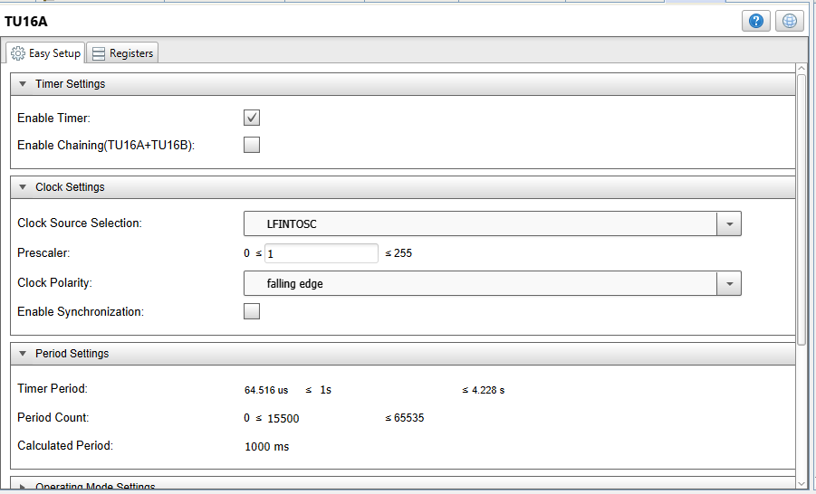
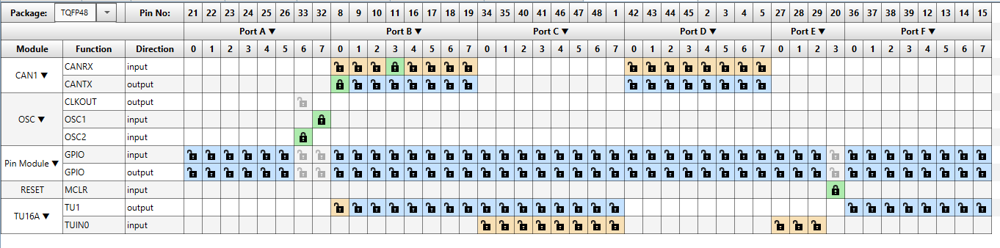

<!-- Please do not change this logo with link -->
[](https://www.microchip.com)

# CAN FD Node using Curiosity Nano, Curiosity Nano Base and CAN FD Click

This example project showcases the setup and use of the new CAN FD module on the PIC18-Q84 family of devices and the new Curiosity Nano board along with the Curiosity Nano Base and CAN FD click to implement a full CAN FD node.  This version of the Curiosity NANO includes a 10Mhz crystal to generate a more accurate clock for the CAN FD module and thus more accurate baud rates. The code periodically transmits CAN frames on a 1 second interval until receiving a specific message (modeled after OBD II), then will respond to certain queries with built-in data.  
## Related Documentation

Basic Configuration of the CAN FD Module Technical Brief [ww1.microchip.com/downloads/en/Appnotes/90003266A.pdf)](https://ww1.microchip.com/downloads/en/Appnotes/90003266A.pdf)
PIC18F27/47/57Q84 Datasheet [ww1.microchip.com/downloads/en/DeviceDoc/PIC18F27-47-57Q84-Data-Sheet-DS40002213C.pdf](https://ww1.microchip.com/downloads/en/DeviceDoc/PIC18F27-47-57Q84-Data-Sheet-DS40002213C.pdf)
## Software Used

- MPLAB® X IDE 5.40 or newer [(microchip.com/mplab/mplab-x-ide)](http://www.microchip.com/mplab/mplab-x-ide)
- MPLAB® XC8 2.20 or a newer compiler [(microchip.com/mplab/compilers)](http://www.microchip.com/mplab/compilers)
- MPLAB® Code Configurator (MCC) 3.95.0 or newer [(microchip.com/mplab/mplab-code-configurator)](https://www.microchip.com/mplab/mplab-code-configurator)
- MPLAB® Code Configurator (MCC) Device Libraries PIC10 / PIC12 / PIC16 / PIC18 MCUs 1.81.1 or newer [(microchip.com/mplab/mplab-code-configurator)](https://www.microchip.com/mplab/mplab-code-configurator)
- Microchip PIC18F-Q Series Device Support (1.6.129) or newer [(packs.download.microchip.com/)](https://packs.download.microchip.com/)


## Hardware Used


  - PIC18F57Q84 Curiosity Nano [(DM182029)](https://www.microchip.com/Developmenttools/ProductDetails/DM182029)
  - Curiosity Nano Base for Click boards™ [(AC164162)](https://www.microchip.com/Developmenttools/ProductDetails/AC164162)
  - ATA6563 Click board™ [(MIKROE-2334)](https://www.mikroe.com/ata6563-click)
  - K2L Optolyzer® MOCCA FD [(B10456)](https://www.k2l.de/products/39/OptoLyzer%C2%AE%20MOCCA%20FD/)

## Setup

The Curiosity Nano Board is used in conjunction with the ATA6563 click board and Curiosity Nano Base for Click boards as the development platform. In addition, some form of CAN FD capable CAN bus analyzer is needed to view the outgoing CAN frames and send incoming CAN frames to the device (the K2L MOCCA FD was used for internal testing of this setup).
ho

The project software was developed in MPLAB X with the help of the MPLAB Code Configurator (MCC) plug-in tool. The MCC tool provides a user-friendly interface that generates software based on the user’s parameters. MCC allows developers who may not be familiar with a new peripheral a way to quickly set up and test a peripheral without having to dive deep into the device datasheet. For this project, the MCC tool was used to generate code for both the CAN FD baud rate, masks, filters, and Transmit/Receive FIFO handling, as well as the Universal Timer module for timing the periodic CAN FD transmissions. The CAN FD Receive interrupt initial setup was also performed using MCC, with the behavior of the interrupt routines being configured in code.


### Universal Timer Configuration
The TU16A module was configured for a 1 second period with an interrupt

```c
void TU16A_Initialize(void)
{
    //Stop Timer
    TU16ACON0bits.ON = 0;
    //OSEN disabled; CLR disabled; LIMIT disabled; CAPT disabled; PRIF disabled; ZIF disabled; CIF disabled; 
    TU16ACON1 = 0x00;
    //EPOL non inverted; CSYNC disabled; START Continous mode - no start due to ERS, timer runs when ON = 1; RESET Timer counter resets at PR match; STOP ERS or PR do not stop the timer; 
    TU16AHLT = 0x0C;
    //CLK LFINTOSC; 
    TU16ACLK = 0x04;
    //ERS TUIN0PPS; 
    TU16AERS = 0x00;
    //PS 1; 
    TU16APS = 0x01;
    //PRH 60; 
    TU16APRH = 0x3C;
    //PRL 140; 
    TU16APRL = 0x8C;
    //TMRH 0; 
    TU16ATMRH = 0x00;
    //TMRL 0; 
    TU16ATMRL = 0x00;
    //CH16AB disabled; 
    TUCHAIN = 0x00;
    // Clearing IF flag before enabling the interrupt.
    TU16ACON1bits.PRIF = 0;
    TU16ACON1bits.ZIF = 0;
    TU16ACON1bits.CIF = 0;
    // Set Default Interrupt Handler
    TU16A_SetInterruptHandler(TU16A_DefaultInterruptHandler);
    // Enabled TUI TU16A interrupt
    PIE0bits.TU16AIE = 1;
    //ON enabled; CPOL falling edge; OM pulse mode; OPOL low; RDSEL read; PRIE enabled; ZIE disabled; CIE disabled; 
    TU16ACON0 = 0x84;
}
```
### Port and PPS Configuration
PORTB3 is set as CANRX , with PORTB0 as CANTX, as those are the pins connected to the CANRX and CANTX pins of the Curiosity NANO board. In addition, PORTA6 and PORTA7 are configured as OSC1 and OSC2 to support the 10MHz crystal on the Curiosity NANO board

```c
void PIN_MANAGER_Initialize(void)
{
    /**
    LATx registers
    */
    LATE = 0x00;
    LATD = 0x00;
    LATA = 0x00;
    LATF = 0x00;
    LATB = 0x00;
    LATC = 0x00;

    /**
    TRISx registers
    */
    TRISE = 0x07;
    TRISF = 0xFF;
    TRISA = 0xFF;
    TRISB = 0xFE;
    TRISC = 0xFF;
    TRISD = 0xFF;

    /**
    ANSELx registers
    */
    ANSELD = 0xFF;
    ANSELC = 0xFF;
    ANSELB = 0xF7;
    ANSELE = 0x07;
    ANSELF = 0xFF;
    ANSELA = 0xFF;

    /**
    WPUx registers
    */
    WPUD = 0x00;
    WPUF = 0x00;
    WPUE = 0x00;
    WPUB = 0x00;
    WPUA = 0x00;
    WPUC = 0x00;

    /**
    ODx registers
    */
    ODCONE = 0x00;
    ODCONF = 0x00;
    ODCONA = 0x00;
    ODCONB = 0x00;
    ODCONC = 0x00;
    ODCOND = 0x00;

    /**
    SLRCONx registers
    */
    SLRCONA = 0xFF;
    SLRCONB = 0xFF;
    SLRCONC = 0xFF;
    SLRCOND = 0xFF;
    SLRCONE = 0x07;
    SLRCONF = 0xFF;

    /**
    INLVLx registers
    */
    INLVLA = 0xFF;
    INLVLB = 0xFF;
    INLVLC = 0xFF;
    INLVLD = 0xFF;
    INLVLE = 0x0F;
    INLVLF = 0xFF;


   
    
	
    RB0PPS = 0x46;   //RB0->CAN1:CANTX;    
    CANRXPPS = 0x0B;   //RB3->CAN1:CANRX;    
}
```
The Universal timer is used for a 1 second "heartbeat" periodic transmission to ensure that the hardware is properly connected and programmed.  This periodic transmission's code is within the Universal Timer 1A's interrupt routine:
```c
void TU16A_DefaultInterruptHandler(void){
    CAN_MSG_OBJ Transmission;
    uint8_t Transmit_Data[8]={0x00,0x11,0x22,0x33,0x44,0x55,0x66,0x77};
    Transmission.field.brs=CAN_BRS_MODE;
    Transmission.field.dlc=DLC_8;
    Transmission.field.formatType=CAN_FD_FORMAT;
    Transmission.field.frameType=CAN_FRAME_DATA;
    Transmission.field.idType=CAN_FRAME_STD;
    Transmission.msgId=0x585;
    Transmission.data=Transmit_Data;
    if(CAN_TX_FIFO_AVAILABLE == (CAN1_TransmitFIFOStatusGet(TXQ) & CAN_TX_FIFO_AVAILABLE))
                {
                    CAN1_Transmit(TXQ, &Transmission);
                }
    
}
```
### CAN FD setup
The CAN FD easy setup has 5 sections. The first is clock setup. For this setup, the system clock is used, so system clock is selected. This will automatically populate the clock frequency (FCAN) window.

The second step is Bit Rate Settings. This configures the nominal and data bit rate (if applicable) based on FCAN. For this example, a 1 Mbps nominal rate and 5 Mbps data rate are selected, the nominal bit rate having 40 TQs per bit, the data bit rate having 8 TQs per bit, and the sample point being 75% for both bit rates.

```c
static void CAN1_BitRateConfiguration(void)
{
    // SJW 9; 
    C1NBTCFGL = 0x09;
    
    // TSEG2 9; 
    C1NBTCFGH = 0x09;
    
    // TSEG1 28; 
    C1NBTCFGU = 0x1C;
    
    // BRP 0; 
    C1NBTCFGT = 0x00;
    
    // SJW 1; 
    C1DBTCFGL = 0x01;
    
    // TSEG2 1; 
    C1DBTCFGH = 0x01;
    
    // TSEG1 4; 
    C1DBTCFGU = 0x04;
    
    // BRP 0; 
    C1DBTCFGT = 0x00;
    
    // TDCO 5; 
    C1TDCH = 0x05;
    
    // TDCMOD Auto; 
    C1TDCU = 0x02;
}
```
The third step is general settings. This only has two options: Enable ISO CRC and Enable Error Interrupt. The ISO CRC is a standard for CAN FD and is in enabled for this example, but some older CAN FD devices/buses may use the non-ISO CRC. The Error Interrupt is for potential issues on messages/buses, and is not used in this demonstration.

The fourth step is the FIFO settings. Here is where the transmit and receive FIFOs are set up. It allows for setting up depth, payload size, and TX/RX selection for each FIFO, while showing how much of the FIFO space is being consumed by the currently selected FIFOs. In addition, this allows for selecting specific interrupt triggers for each FIFO which will generate the function prototypes/pointers for these interrupts in the code. In this example, the TXQ is used as the transmit FIFO, with FIFO1 being set as receive. The TXQ is set to a depth of 2 and a payload of 8 bytes, with FIFO1 being set to a depth of 4 and a payload of 8 bytes. In addition, FIFO1 is set to interrupt on not-empty so that it will interrupt upon receiving any data, instead of waiting to receive multiple messages.

```c
static void CAN1_RX_FIFO_Configuration(void)
{
    // TXEN disabled; RTREN disabled; RXTSEN disabled; TXATIE disabled; RXOVIE disabled; TFERFFIE disabled; TFHRFHIE disabled; TFNRFNIE enabled; 
    C1FIFOCON1L = 0x01;
    
    // FRESET enabled; TXREQ disabled; UINC disabled; 
    C1FIFOCON1H = 0x04;
    
    // TXAT Unlimited number of retransmission attempts; TXPRI 1; 
    C1FIFOCON1U = 0x60;
    
    // PLSIZE 8; FSIZE 4; 
    C1FIFOCON1T = 0x03;
    
    CAN1_SetFIFO1NotEmptyHandler(DefaultFIFO1NotEmptyHandler);
    
    C1INTUbits.RXIE = 1;
    
    PIR4bits.CANRXIF = 0;
    PIE4bits.CANRXIE = 1;
}
```
```c
static void CAN1_TX_FIFO_Configuration(void)
{
    // TXATIE disabled; TXQEIE disabled; TXQNIE disabled; 
    C1TXQCONL = 0x00;
    
    // FRESET enabled; UINC disabled; 
    C1TXQCONH = 0x04;
    
    // TXAT 3; TXPRI 1; 
    C1TXQCONU = 0x60;
    
    // PLSIZE 8; FSIZE 2; 
    C1TXQCONT = 0x01;
    
}
```
The final setup is the Filter Object Settings This allows for setup of masks and filters, which determine which message IDs are accepted. Each filter object can be associated with a specific receive FIFO and any number of message IDs can be entered, which will automatically set up the masks/filters to accept those IDs.  In this case, the 


```c
static void CAN1_RX_FIFO_FilterMaskConfiguration(void)
{
    // FLTEN0 enabled; F0BP FIFO 1; 
    C1FLTOBJ0L = 0xDF;
    C1FLTOBJ0H = 0x07;
    C1FLTOBJ0U = 0x00;
    C1FLTOBJ0T = 0x00;
    C1MASK0L = 0xFF;
    C1MASK0H = 0x07;
    C1MASK0U = 0x00;
    C1MASK0T = 0x40;
    C1FLTCON0L = 0x81; 
    
}
```

Finally, the CAN is set up to interrupt when the receive FIFO is not empty.  The logic for processing and handling incoming messages is placed within this interrupt.

```c
static void DefaultFIFO1NotEmptyHandler(void)
{
    TU16ACON0bits.ON = 0;  //stop the periodic heartbeat, go into response mode
    CAN_MSG_OBJ Currently_Processing;
    CAN_MSG_OBJ Return_Message;
    uint8_t data_Out[8];
    uint8_t mode=0;
    uint8_t PID=0;
    uint8_t numBytes=0;
    while(1)
    {
        if(CAN1_ReceivedMessageCountGet() > 0) 
        {
            if(true == CAN1_ReceiveFrom(FIFO1,&Currently_Processing)) //receive the message
            {
                break;
            }
        }
    }
    numBytes=Currently_Processing.data[0];
    mode=Currently_Processing.data[1];
    PID=Currently_Processing.data[2];
    Return_Message.msgId=0x7E8;
    Return_Message.field.dlc=8;
    Return_Message.field.brs=CAN_BRS_MODE;
    Return_Message.field.idType=CAN_FRAME_STD;
    Return_Message.field.formatType=CAN_FD_FORMAT;
    Return_Message.field.frameType=CAN_FRAME_DATA;
    data_Out[1]=mode+0x40;
    data_Out[2]=PID;
    data_Out[7]=0x55; //00h or 55h recommended by SAE standard
    if (mode!=0x01||numBytes!=2)  //only respond with current data and a SAE standard broadcast request with 2 following bytes
    {
        return;
    }
    
    else if (PID==0x00)  //PIDs supported
    {
        data_Out[0]=6;
        data_Out[3]=0x18;  //supports engine load, coolant temp
        data_Out[4]=0x78;  //supports fuel pressure, intake pressure, engine speed, vehicle speed
        data_Out[5]=0x00;
        data_Out[6]=0x00;  //no more supported PIDs
        
    }
    
    else if (PID==0x04) //Engine Load
    {
        data_Out[0]=3;
        data_Out[3]=191; //~75% engine load
        data_Out[4]=0x55;  
        data_Out[5]=0x55;
        data_Out[6]=0x55;  
    }

    else if (PID==0x05) //Coolant Temp
    {
        data_Out[0]=3;
        data_Out[3]=100; //60C
        data_Out[4]=0x55;  
        data_Out[5]=0x55;
        data_Out[6]=0x55; 
    }
    
    else if (PID==0x0A) //Fuel Pressure
    {
        data_Out[0]=3;
        data_Out[3]=150; //450 kPA
        data_Out[4]=0x55;  
        data_Out[5]=0x55;
        data_Out[6]=0x55; 
    }
    
    else if (PID==0x0B) //Intake Pressure
    {
        data_Out[0]=3;
        data_Out[3]=200; //200 kPA
        data_Out[4]=0x55;  
        data_Out[5]=0x55;
        data_Out[6]=0x55; 
    }
    
    else if (PID==0x0C) //Engine Speed
    {
        data_Out[0]=4;
        data_Out[3]=54;    //256A+B/4=3500 RPM
        data_Out[4]=176; 
        data_Out[5]=0x55;
        data_Out[6]=0x55; 
    }
    
    else if (PID==0x0D) //Vehicle Speed
    {
        data_Out[0]=3;
        data_Out[3]=70;  //70 km/h
        data_Out[4]=0x55;  
        data_Out[5]=0x55;
        data_Out[6]=0x55; 
    }
    
    else if (PID==0xFF) //go back to heartbeat mode
    {
        TU16ACON0bits.ON = 1;  //stop the response mode, go into periodic heartbeat
        return;
    }
        Return_Message.data=data_Out; 
        if(CAN_TX_FIFO_AVAILABLE == (CAN1_TransmitFIFOStatusGet(TXQ) & CAN_TX_FIFO_AVAILABLE))
        {
            CAN1_Transmit(TXQ, &Return_Message);
        }
        return;
    

}
```


## Operation

On Power-up, the code will periodically transmit messages 

However, upon receiving a message with the CAN ID of 0x7DF, it will cease the periodic messages and go into response mode.  In this mode it will respond to specific messages, as shown below:


After sending a message with 0xFF in the third data byte while in response mode, the node will return to periodic mode and begin sending periodic messages again.
## Summary

This Demo gives an example of hardware and software setup for a basic CAN node with both periodic and response-driven transmissions, showcasing baud rate setup, message filtering, and RX and TX setup.  
